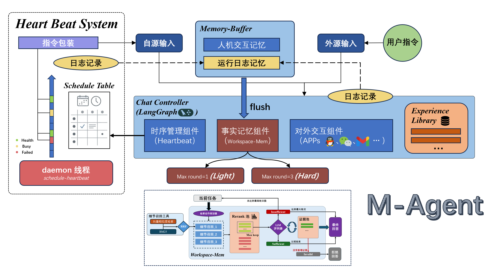
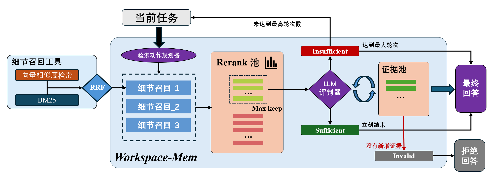
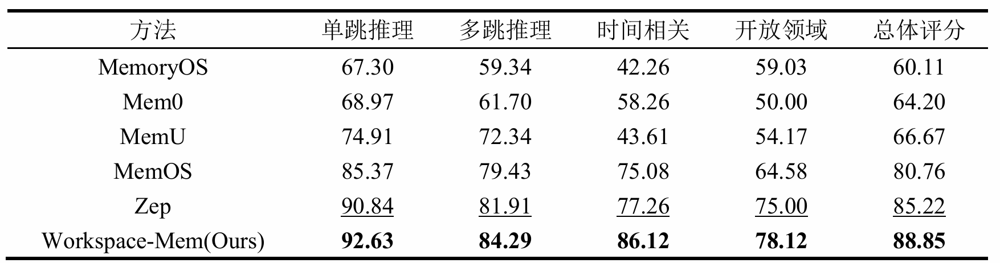

# M-Agent

**M-Agent** 是一个以**记忆**为核心、面向**个人信息生活**的智能体框架。



## 运行方式
### 服务端
- **以服务方式运行智能体（FastAPI + SSE）**：创建 run、订阅事件流、获取最终结果，并维护 thread 级会话状态。
### 应用端
- **M-Agent-UI**：最简单的信息交互形式【已推出】
- **M-Agent-desktop**: 桌面形式的助手

---

## 仓库结构

主代码位于 `src/m_agent/`，可执行入口集中在 `scripts/`，自动化测试在 `tests/`，示例在 `examples/`，实验性集成在 `experiments/`。配置在 `config/`，运行产物多在 `data/` 与 `log/`。

更完整的目录说明与设计约定见：**[docs/project-structure.md](docs/project-structure.md)**。

---

## 环境要求

- **Python**：`>= 3.10`（见 `pyproject.toml`）
- **Neo4j（可选）**：当启用图存储/实体关系相关能力时需要（需自行安装并保证连接配置与项目一致）
- **LLM / 嵌入 / Rerank**：通过 `.env` 与 `config/` 下的 YAML 指定兼容 OpenAI 或阿里云等提供商（见下文）

---

## 安装

在项目根目录：

```powershell
# Windows PowerShell 示例
python -m venv .venv
.\.venv\Scripts\activate
python -m pip install --upgrade pip
pip install -r requirements.txt
```

也可使用可编辑安装（便于本地开发）：

```bash
pip install -e .
```

---

## 环境变量（`.env`）

在项目根目录创建 `.env`，按需填写密钥与基础 URL。以下为常见项（具体以仓库内配置注释为准）：

```dotenv
# MemoryCore LLM（如 src/m_agent/load_model/OpenAIcall.py）
# API_SECRET_KEY 与 OPENAI_API_KEY 二选一填写即可
API_SECRET_KEY=你的_OpenAI_兼容密钥
OPENAI_API_KEY=
BASE_URL=https://api.openai.com/v1

# Agent 模型（LoCoMo 默认等配置可能指向 gpt-4o-mini 等；MemoryAgent 会将密钥映射到 LangChain 所需的 OPENAI_*）
DEEPSEEK_API_KEY=你的_DeepSeek_密钥

# 嵌入（embed_provider，见 config/memory/core/*.yaml）
ALIBABA_API_KEY=你的_阿里云_Key
ALIBABA_BASE_URL=https://dashscope.aliyuncs.com/compatible-mode/v1
ALIBABA_EMBED_MODEL=text-embedding-v4
# Rerank：兼容接口示例；新加坡地域可改用 dashscope-intl

# 可选开关（与当前仓库默认保持一致即可）
LANGUAGE=zh
EMBED_PROVIDER=aliyun
LLM_PROVIDER=deepseek
```

---

## 用法一：Chat API 后台常态启动（FastAPI）

仓库提供基于 **启动时固定配置 + 线程级会话状态** 的 HTTP / SSE 对话服务（非「每次请求携带完整 config」模式）。

启动示例（PowerShell）：

```powershell
$env:PYTHONPATH = "src"
python -m m_agent.api.chat_api `
  --host 127.0.0.1 `
  --port 8777 `
  --config config/agents/chat/chat_controller.yaml `
  --idle-flush-seconds 1800 `
  --history-max-rounds 12 `
  --schedule-beat-seconds 10 `
  --schedule-busy-retry-seconds 5 `
  --users-db config/users/users.json `
  --session-ttl-seconds 43200
```

启动后可访问：

- Swagger：`http://127.0.0.1:8777/docs`
- OpenAPI JSON：`http://127.0.0.1:8777/openapi.json`

完整接口说明、认证、线程事件与日程等见：**[docs/chat_api/README.md](docs/chat_api/README.md)**。


## 事实记忆系统（Workspace-Mem）

Workspace-Mem为独立研发的基于证据驱动的记忆系统，该系统能够实现**不同强度的记忆推理**和**不同来源的证据的合并整理**，使得智能体能同时使用多种不同来源，不同结构的记忆库。能在对情景信息进行精准的召回和分析的情况下应对现实场景中错综复杂的实体级别的问题。


**图 1.** Workspace-Mem的检索框架展示 

当前的记忆系统仍在进行研发中，当前实现的版本已在纯情景记忆库**LOCOMO**中展现出具有竞争力的效果：

**图 2.** Workspace-Mem在LOCOMO数据集上的效果横向对比  
关于该项目在复杂输入环境与复杂理解环境中的记忆效果的相关基准和测试结果将在近期展示，敬请期待...

更多实现细节与工程约定（例如 `episodes → scene → atomic facts` 的生成与数据目录组织）建议从下面文档开始读：

- **[scripts/run_locomo/README.md](scripts/run_locomo/README.md)**（配置驱动的工作流与数据目录说明）
- **[docs/project-structure.md](docs/project-structure.md)**（代码/脚本/路径约定）

---


## 测试

```bash
pytest
```

标记与策略见 `pyproject.toml` 中 `[tool.pytest.ini_options]`。

---

## 文档索引

| 文档 | 内容 |
| --- | --- |
| [docs/project-structure.md](docs/project-structure.md) | 目录约定与常用命令 |
| [scripts/run_locomo/README.md](scripts/run_locomo/README.md) | LoCoMo 配置与各子脚本详解 |
| [docs/chat_api/README.md](docs/chat_api/README.md) | Chat API 完整参考 |
| [tools/M-Agent-UI/API.md](tools/M-Agent-UI/API.md) | 前端对接 API 说明 |

---

## 许可证

本项目使用 **MIT License**，详见根目录 [LICENSE](LICENSE)。

---

**English README：** [README.md](README.md)
